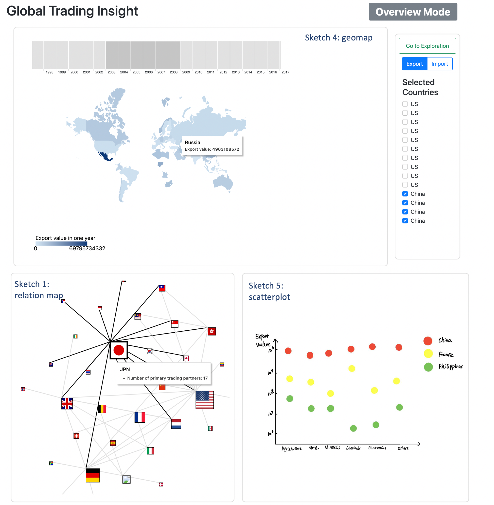
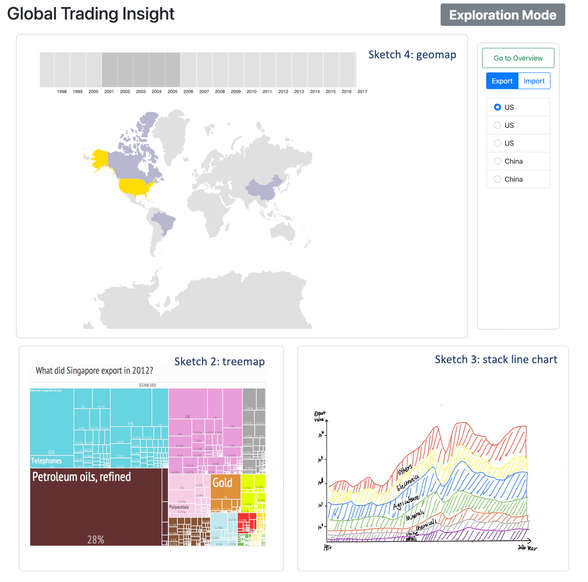

# Global Trading Insight

We dedicate this visualization project to explore the global commercial trading over the past several decades. In this visualization, there are two modes, Overview Mode and Exploratory Mode, that contain different
views respectively. The Overview mode aims to enable users to analyze what role does each primary trading country act in
the world. The Exploratory mode presents the details of a specific country’s trading records from multiple perspectives.

## Overview Mode

In this mode, users can have an overview of the major international trading activities. There are three views: Geo Map, Relation Graph and Scatter Plot.

## Exploration Mode

In this mode, users can dive into the trading details of the selected country. There are three views: Geo Map, Tree Map and Stacked Stream Graph.

## Functionalities

### Relation Graph
* drag the Year slider will change the data that powers three views
* drag the Max Number of Nodes will adjusts the number of nodes displayed in the relation graph
* drag the Node Force slider will adjust the repulsion force between nodes
* hover over the node will show a tooltip with a bar chart. The bar chart presents the export/import amount over different product categories.
* hover over the edge will highlight the two bonding countries, and show a tooltip
* click on node will highlight its edges.

### Scatter Plot
* hover over the mark will show a tooltip, and highlight all other marks belongs to the same country.

### Geo Map
* hover over a countries will show a tooltip

### Tree Map
* hover over a product category will show a tooltip

### Widget
* switch the Export/Import toggle will change all the values of three views to the corresponding type.
* check single country will show the treemap
* check multiple countries will show the scatter plot

