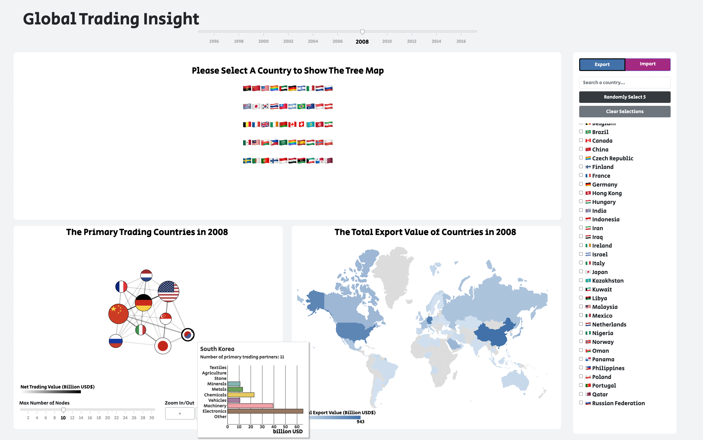
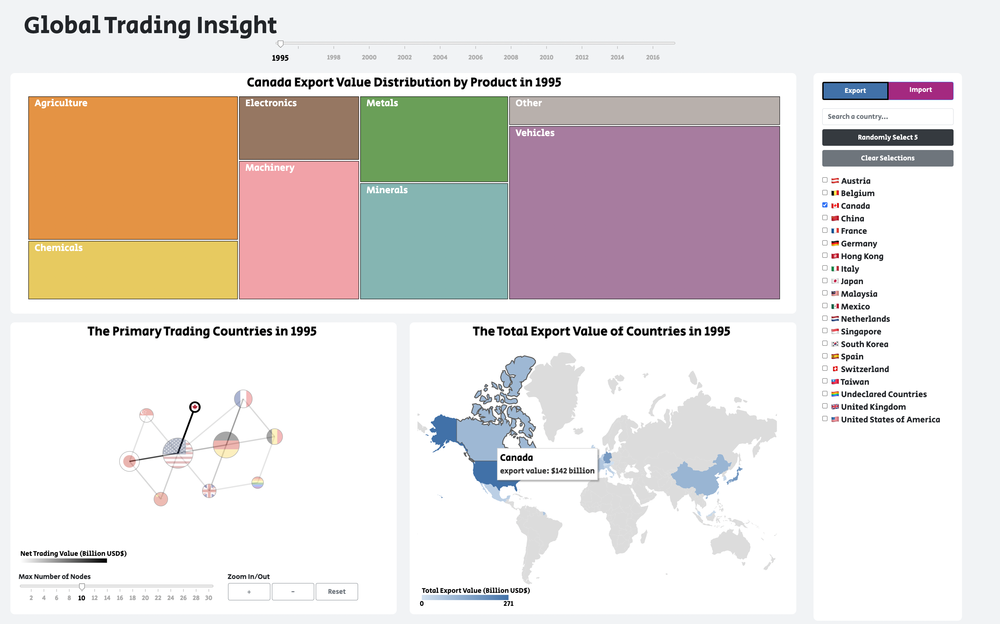
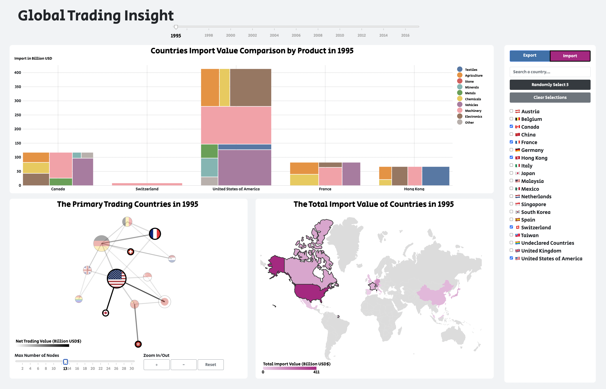
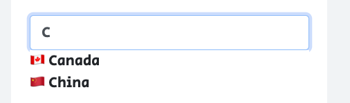

# Global Trading Insight

We dedicate this visualization project to explore the global commercial trading over the past several decades.

## When no country selected

## When one country selected and toggled to export

## When 5 countries randomly selected and toggled to import 

## Views
### Relation Graph
* drag the Year slider will change the data that powers three views
* drag the Max Number of Nodes will adjusts the number of nodes displayed in the relation graph
* drag the Node Force slider will adjust the repulsion force between nodes
* hover over the node will show a tooltip with a bar chart. The bar chart presents the export/import amount over different product categories.
* hover over the edge will highlight the two bonding countries, and show a tooltip
* click on node will highlight its edges.

### Geo Map
* hover over a countries will show a tooltip

### Tree Map
* hover over a product category will show a tooltip

## Widget
* switch the Export/Import toggle will change all the values of three views to the corresponding type.
* check single country will show the treemap
* check multiple countries will show the scatter plot

## Credits

